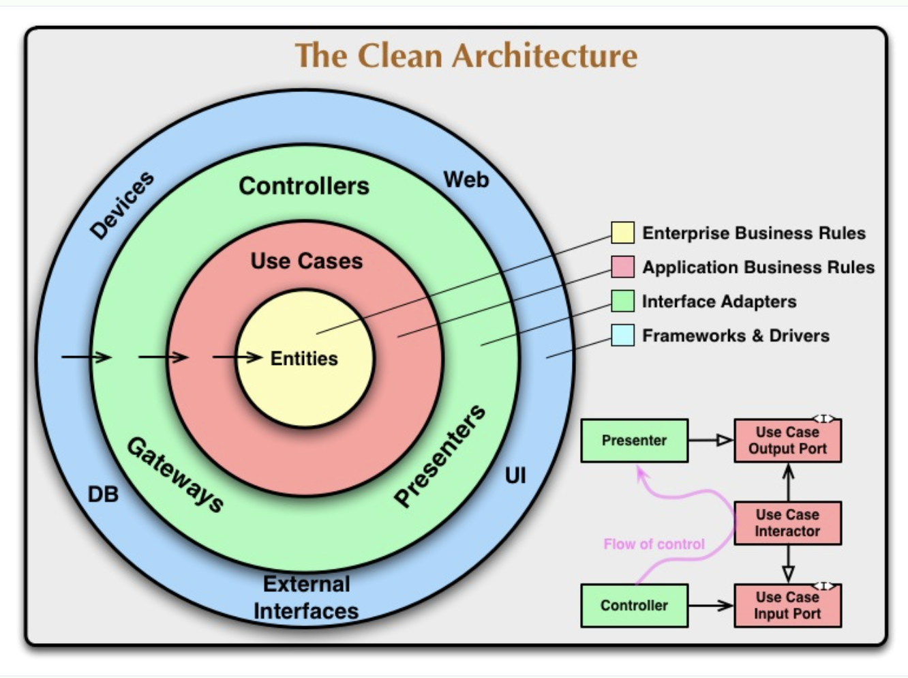

# **Clean Architecture Ride API**

Este conteúdo é parte do curso Clean Code e Clean Architecture da Branas.io

Para mais informações acesse: https://branas.io

---
Durante o curso foram abordados vários conceitos e práticas de desenvolvimento, a seguir vou destacar alguns:

### Hexagonal
Também conhecida como arquitetura ports and adapters, esta arquitetura visa
dividir as responsabilidades de negócio, recursos externos e usuários da aplicação de modo que cada uma se comunique
com a outra através de interfaces (ports) independente de quem implementa essa interface (adapter)

### Clean Architecture
É uma arquitetura hexagonal, mas incluíndo o domain driver design (DDD), que é basicamente dividir ainda mais as responsabilidades
de negócio, entre Entities, Value Objects e Domain Services

### Sobre o projeto:
Durante as aulas foram criados alguns casos de uso, divididos entre 4 APIs (ride, payment, account e position). Cada api 
se comunica com a outra através do padrão gateway e de uma arquitetura orientada a eventos, permitindo assim que elas 
se mantenham resilientes e não perdendo nenhuma transação.

O resultado final é uma aplicação de corrida como o uber, 99, etc
 
Casos de usos:
- Signup (account)
- Requisitar corrida (ride)
- Aceitar corrida (ride)
- Atualizar posição da corrida (ride e position)
- Finalizar corrida (ride)
- Processar pagamento (payment)

> ## Design Patterns

- Factory
- Adapter
- Composite
- Decorator
- Proxy
- Dependency Injection
- Abstract Server
- Composition Root
- Singleton

> ## Metodologias e Designs
- SOLID
- TDD
- Clean Architecture
- DDD
- Use Cases

> ## Tecnologias
- Node JS
- Postgresql
- MongoDB
- RabbitMQ
